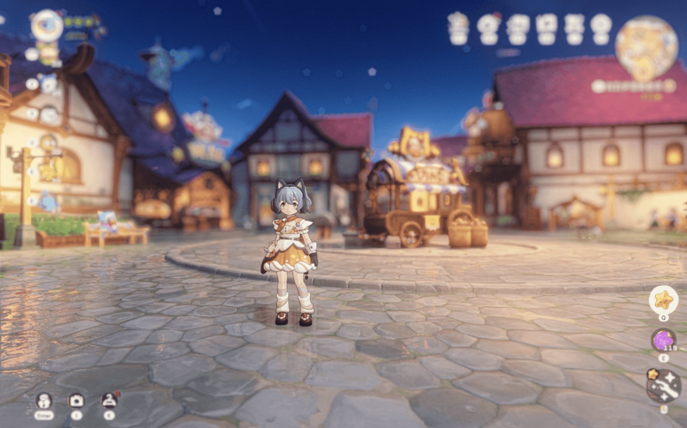

# RockDLL

Simple DLL injector for ReShade / 简易 ReShade DLL 注入器



---

## 使用说明 / Usage

### 前置要求 / Prerequisites

- 安装 ReShade 后，将 `dxgi.dll` 和 `ReShade.ini` 以及 `reshade-shaders` 文件夹从游戏目录移动到其他位置
- After installing ReShade, move `dxgi.dll`, `ReShade.ini` and `reshade-shaders` folder from game directory to another location
- 这是必要的，因为 ACE 反作弊会检测游戏目录中的修改文件
- This is necessary because ACE anti-cheat detects modified files in the game directory

### 配置 / Configuration

编辑 `config.ini`:

```ini
[INJECT]
target=NRC-Win64-Shipping.exe
dlls=C:\Mods\RockDLL\dll\dxgi.dll
```

### 运行 / Run

1. 先启动游戏 / Run the game first
2. 运行 `RockDLL.exe` / Run `RockDLL.exe`
3. 程序会自动请求管理员权限 / Program will request admin automatically

---

## 构建 / Build

```bash
mkdir build && cd build
cmake .. -G "MinGW Makefiles"
cmake --build . --config Release
```

---

## 注意事项 / Notes

- 需要管理员权限（会自动请求）/ Admin privileges required (auto-requested)
- 游戏必须在注入前运行 / Game must be running before injection
- ACE 反作弊不会阻止本注入方式 / ACE anti-cheat will not block this injection method

---

## 免责声明 / Disclaimer

**本程序不对你的使用产生的任何后果担责。**

**This program is not responsible for any consequences arising from your use.**

有问题请不要提交 Issues，这是一次性产物。有更新需求可以将 `AGENTS.md` 喂给你的 AI。

**Do not submit Issues for problems. This is a one-time project. For updates, feed `AGENTS.md` to your AI.**

ReShade 相关问题请前往 [ReShade](https://reshade.me/) 反馈。

**For ReShade related issues, please report to [ReShade](https://reshade.me/).**
